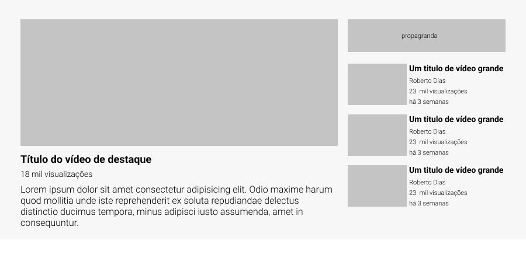

# Layout YouTube
Esse é um exercício sugerido pelo curso DevQuest com o objetivo de replicar o layout principal do site YouTube

## Tecnologias utilizadas
-Semantica HTML
-Propiedades CSS
-Flexbox
-GRID

## Tipografia

Tamanhos: 18px, 16px,14px |  14,11px

Pesos: 700, 300

Font Roboto

Cores: #c4c4c4, #f7f7f7